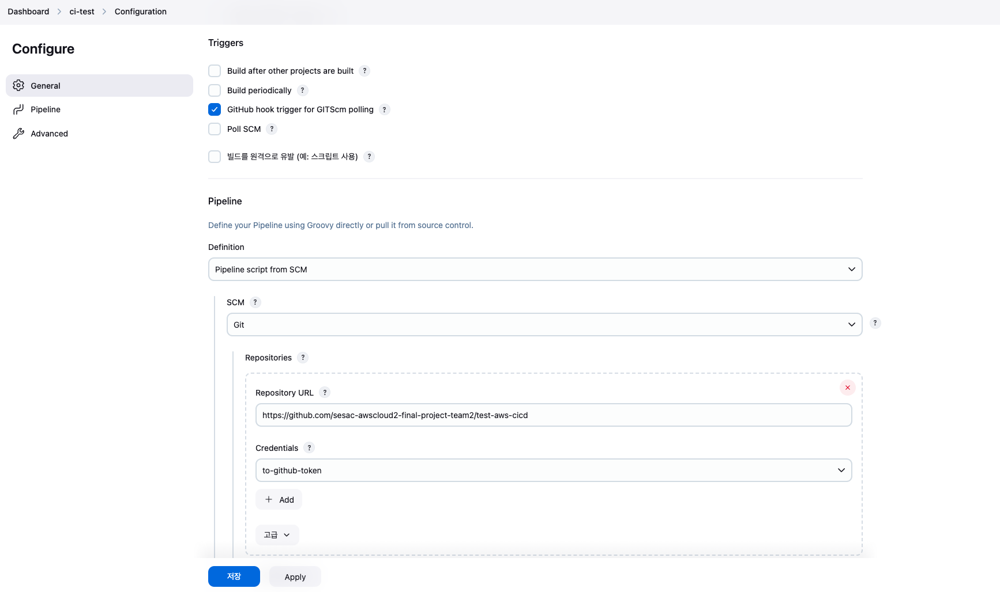

# Collector
> 수신된 데이터를 dynamodb에 저장

## (수동) 이미지 ECR 업로드
```bash
aws ecr get-login-password --region ap-northeast-2 | docker login --username AWS --password-stdin 390844761387.dkr.ecr.ap-northeast-2.amazonaws.com
docker image build --platform linux/amd64 -t collector .
docker tag collector:latest 390844761387.dkr.ecr.ap-northeast-2.amazonaws.com/collector:latest
docker push 390844761387.dkr.ecr.ap-northeast-2.amazonaws.com/collector:latest
```

## (자동) Jenkins를 이용해 이미지 ECR 업로드
1. jenkins 서버 구축 (aws bastion 서버)
    - `jenkins.sh` 실행
    - 젠킨스 gui 
        - 초기 접속: 쉘 실행시 결과 참고하여 administator password 입력 → Install suggested plugins 클릭 → admin 계정 생성
        - github 연결: 젠킨스 관리 → 시스템 설정 → github 토큰(이미 등록된 `from-github-token`)으로 연결
        - CI Pipeline 프로젝트 생성: 새로운 Item 클릭 → 이름 입력, 파이프라인 클릭 → 아래 이미지와 같은 설정 → branch 이름을 master(x) `deploy`로 수정
        
2. 깃허브 설정
    - 연결할 repo 설정 접속하여 webhook 등록 (아래 이미지 참고)
    
    - ip 주소는 bastion server의 공인 ip로 등록
3. 깃허브 `deploy` 브랜치로 push: 자동으로 이미지 업로드